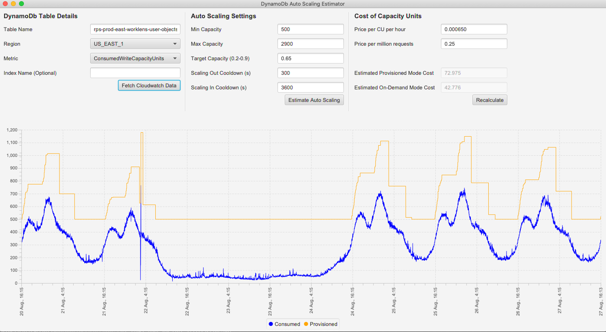
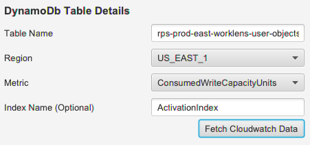
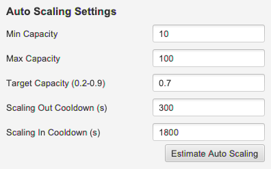
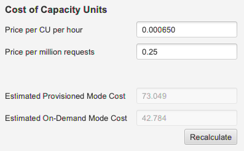

Earl
----

Earl is a tool designed to help estimate how much you spent on DynamoDb in the last week. It can help you tweak your
auto scaling settings to help you minimise wastage and compare the cost of provisioned vs. on-demand capacity modes.


DynamoDb auto scaling behaviour can be difficult to predict for a human brain but this app will take the guess work
out of the planning. If you find the waste of your money to be *unacceptable*, then this is the tool for you!



## Building and Running

Earl is written in Kotlin, and uses JavaFX and SpringBoot while targeting Java11. To run Earl, install 
[JDK11](https://adoptopenjdk.net/) and set your JAVA_HOME to point to it. Then run the project with the gradle command

```bash
./gradlew bootrun
``` 

## How to use Earl

To use Earl, you need to have valid AWS credentials in your environment to access the cloud watch data for the table
you'd like to investigate.

The primary motivation of Earl is try out different auto scaling configurations in a quick, easy and **safe** way.
DynamoDb auto scaling behaviour is very hard to predict and quite often, developers go on the conservative side of 
over-provisioning. This tool will help you try out different settings to see what works for your table.

Earl will also compare the cost of your auto scaling settings to on-demand capacity mode, to help you make that choice.

### Fetching Cloud Watch Data

The process starts with fetching the usage data from could watch. Fill in the fields to fetch the data



| Variable   | Description                                      |
|------------|--------------------------------------------------|
| Table Name | Name of your DynamoDb table in AWS               |
| Region     | The AWS region to fetch data from                |
| Metric     | Fetch data for read or write capacity units      |
| Index Name | Optional. The name of any global secondary index |

When you have filled out the fields, hit the "Fetch Cloudwatch Data" button. This will retrieve the usage data for that
table for the previous week. This data will show up on the chart below.

### Provisioned Capacity from Auto Scaling

Earl doesn't use cloud watch to display the provisioned capacity. Instead, Earl will use the inputs in the "Auto Scaling 
Settings" section to instead predict how auto scaling will behave. The prediction is quite accurate for the most part but
can be off at the very start of the data, where previous data could have influenced it.



| Variable             | Description                                                     |
|----------------------|-----------------------------------------------------------------|
| Min Capacity         | Minimum scaling capacity                                        |
| Max Capacity         | Maximum scaling capacity                                        |
| Target Capacity      | Target usage capacity (between 0.2 - 0.9)                       |
| Scaling Out Cooldown | In seconds. The configured cooldown between scaling up events   |
| Scaling In Cooldown  | In seconds. The configured cooldown between scaling down events |

Hit the "Estimate Auto Scaling" button once you have your cloudwatch data loaded, to then also add the auto scaling
provisioned capacity to the graph below.

### Cost Estimation

Earl will also attempt to estimate the cost of running this table for the last week based on the data from cloud watch
and the auto scaling provisioned capacity.



| Variable                   | Description                                                                            |
|----------------------------|----------------------------------------------------------------------------------------|
| Price per CU per hour      | Price per Read/Write capacity unit in USD in provisioned capacity mode                 |
| Price per million requests | Price per million Read/Write request in USD in pay-per-request/on-demand capacity mode |

_Note: All prices are in USD_

This is the pricing info that comes from the [public AWS pricing page](https://aws.amazon.com/dynamodb/pricing/). This
is designed as an input for varying prices (e.g. price of RCUs/rWCUs, different regions, etc.). Update this number to
match the pricing for your region/account.

You may hit the "Recalculate" button to refresh the prices, if any other box was updated.

## Other Notes

Earl was developed by myself as my innovation week project on a pretty tight deadline. I couldn't give it all the love I would 
like to. As a result, there is no real exception handling or tests. It's all happy path or nothing. Kotlin does a really
good job of eliminating many sources of errors but I'm sure some are still present. If you notice something broken,
feel free to let me know or to push a fix.
